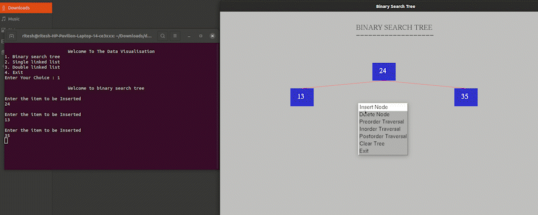

### **Project Name:**
# Data Structure Visualizer
#### About Project:

- A data structure is a particular way of organizing data in a computer so that it can be used effectively. 

- This is a Data Structure Visualizer implemented using C programming language with GUI.

- It helps in visualising linear and non linear data structures.

- Data Structures included in this projects are :
  1. Linked List
  2. Doubly Linked List
  3. Binary Search Trees
 

#### How to run the code? (For Linux)

- Install OpenGL library using following command :

  ```sudo apt-get install freeglut3-dev```

- Go to your terminal and run (not compulsory):

  ```make```
    
- Run the executable file, for that use :
  ```./final```
  
  **For Windows** , Visual Studio is required, any suggestions on how to compile OpenGL on windows are most welcome :).

#### Technologies Used:

- C  
- OpenGL
- GL Utility Toolkit

#### Working Application (Some features)

- Insert in BST


- Preorder Traversal


 
 - InOrder Traversal


- Delete BST


#### Screenshots

- Linked List 


- Doubly Linked List


- BST 


#### Motivation 

- [VisualALgo.net](https://visualgo.net/en)
- [SortingAlgo Visualizer](https://github.com/Ritesh2408/Sorting_Algorithm_Visualizer)

#### References

- [GLUT Docs](http://freeglut.sourceforge.net/docs/api.php) 
- [OpenGL Docs](https://docs.gl/) 
- [GeeksforGeeks](https://www.geeksforgeeks.org/getting-started-with-opengl/)
